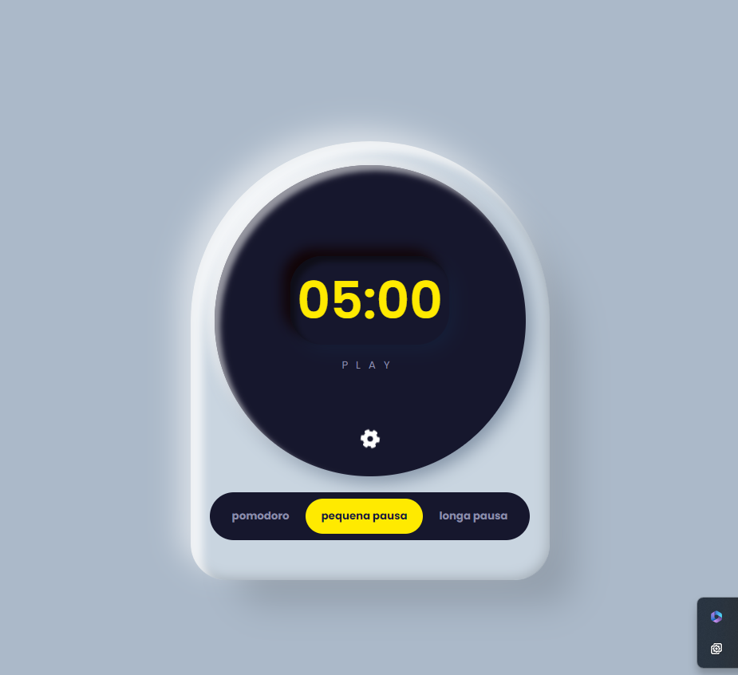

<h1>Project Pomodoro</h1>
<h3>The Pomodoro Project is an application designed to help with time management, based on the Pomodoro technique. The tool allows the user to set up 25-minute intervals of focused work, followed by short 5-minute breaks. After four Pomodoro cycles, the user is given a longer break of 15 to 30 minutes. The goal of the project is to increase productivity by improving time management and avoiding procrastination.</h3>
